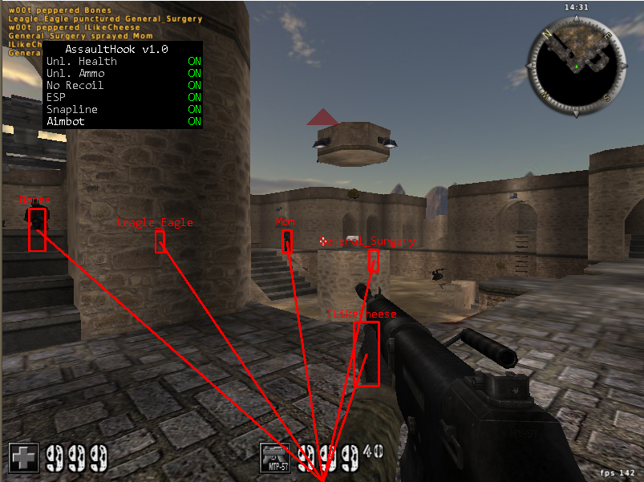

# AssaultHook
is an internal cheat for the game [AssaultCube](https://github.com/assaultcube/AC) written in c++. I wrote this cheat to refresh my introduction to programming. The game AssaultCube was chosen for this because it needs little resources, is open source and well documented for cheat development.

After the AssaultHook-DLL is injected into the game, a new thread is created. In this thread the needed hack instances are created and the opengl function [`wglSwapBuffers`](https://docs.microsoft.com/en-us/windows/win32/api/wingdi/nf-wingdi-wglswaplayerbuffers) is hooked using a [trampoline function](http://jbremer.org/x86-api-hooking-demystified/#ah-trampoline). The cheat logic is then executed in the hooked function. The advantage of the `wglSwapBuffers` function is that it is called at the end of each rendered frame.

### The cheat has the following features:
| feature | how its done |
| --- | --- |
| Unlimited health | set integer every tick |
| Unlimted ammo | set integer every tick |
| No recoil | overwrite instructions: instead of calculate the recoil just return directly |
| ESP | loop over the entitiy list; calculate the screen position using the [`WorldToScreen`](https://guidedhacking.com/threads/world2screen-direct3d-and-opengl-worldtoscreen-functions.8044/) function; render a rectangle|
| Snapline | same as esp; but render a line to the entity |
| Aimbot | loop over the entitiy list; check if the entity is alive; check if the entity is visible, by calling the trace line function from assault cube; calculate the needed viewing angles; set the viewing angles |

## Used tools
- [CheatEngine](https://cheatengine.org/)
- [ghidra](https://github.com/NationalSecurityAgency/ghidra)
- [ReClass.net](https://github.com/ReClassNET/ReClass.NET)
- [Visual Studio 2022](https://visualstudio.microsoft.com/de/)

## Credits
- [guidedhacking.com](https://guidedhacking.com)